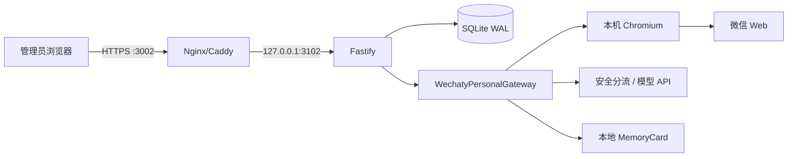

# 观心镜系统分析

版本：V1.1（个人微信）

## 1. 目标架构

公众号回调、AppID/AppSecret 和微信服务器 443 回调不属于当前架构。

## 2. 关键决策

| 决策 | 结果 | 原因 |
| --- | --- | --- |
| 微信形态 | 个人号扫码登录 | 用户明确要求，不使用公众号 |
| 协议 | Wechaty Web Puppet | MVP 无外部 provider token，满足本地化约束 |
| 数据库 | SQLite WAL | 单机、低并发、无需 Redis |
| 登录凭据 | MemoryCard 本地文件 | 与业务数据隔离，支持重启恢复 |
| 二维码 | 服务端本地渲染，内存保存 | 避免将短期登录凭据落库 |
| 激活时机 | Wechaty login 事件 | 只有真实登录后才可接收消息 |
| 消息范围 | 好友文本私聊 | 最小数据收集，排除群聊和媒体 |

## 3. 信任边界

- 管理端：Cookie + CSRF，仅管理员可创建、扫码、启停和退出。
- 微信边界：扫码必须在手机确认；服务端不能验证或保证微信风控结果。
- 模型边界：只发送本次必要文本与趋势上下文，不发送微信 Cookie。
- 本地文件：SQLite、MemoryCard、`.env` 都是敏感资产，归属专用 Linux 用户。

## 4. 一致性与恢复

- 渠道激活和 runtime 启用在同一 SQLite 事务中完成。
- 入站消息先以唯一键落库，再调用模型，避免同一进程内重复生成。
- 进程关闭时停止 Bot；重启后自动恢复 ACTIVE 渠道。
- MemoryCard 无效时状态进入 FAILED/OFFLINE，管理员重新扫码。
- 删除登录会话只删除精确 settingId 对应文件，不递归删除目录。

## 5. 失败模式

| 失败 | 可见行为 | 恢复 |
| --- | --- | --- |
| Chromium 缺失 | 扫码 API 502，返回配置路径 | 安装 Chromium/修正环境变量 |
| Web 登录不兼容 | FAILED 或长期无二维码 | 换专用账号；必要时更换 Puppet provider |
| 二维码超时 | EXPIRED/OFFLINE | 重新生成 |
| 会话过期 | OFFLINE/FAILED | 重新扫码 |
| 模型失败 | 写审计，不泄露密钥 | 修复模型配置后重试新消息 |
| 磁盘满/SQLite 锁 | 请求失败并记录服务日志 | 释放空间、恢复备份、重启 |

## 6. 安全评估

高风险来自非官方个人号协议及旧版浏览器依赖，不来自 SQLite 选型。控制措施：专用微信号、无 root 服务用户、Chromium 沙箱边界外再加宿主隔离、会话目录 `0700`、后台只走 HTTPS、禁止公开调试端口、日志脱敏、依赖漏洞持续复核。

发布结论：代码原型可运行；未完成目标 Linux + 真实专用微信号端到端验证前，公开生产发布为 `NO-GO`。
